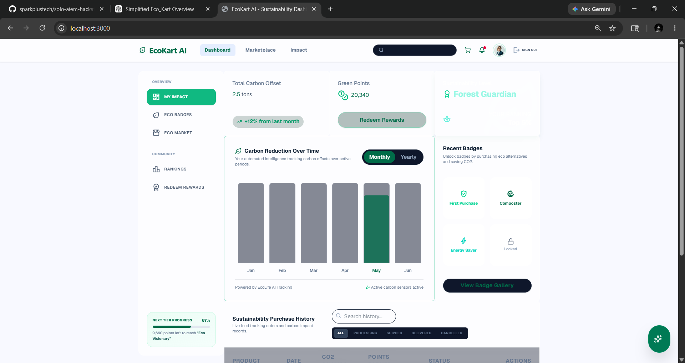
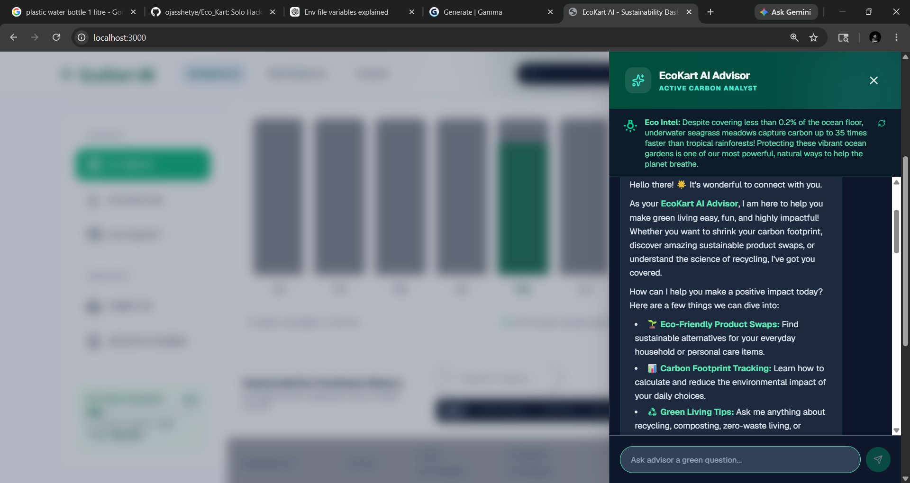
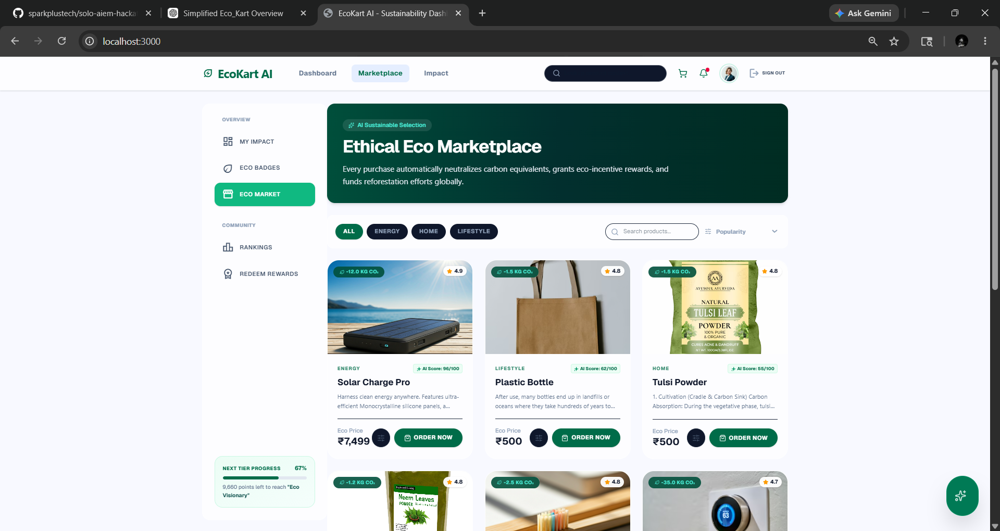
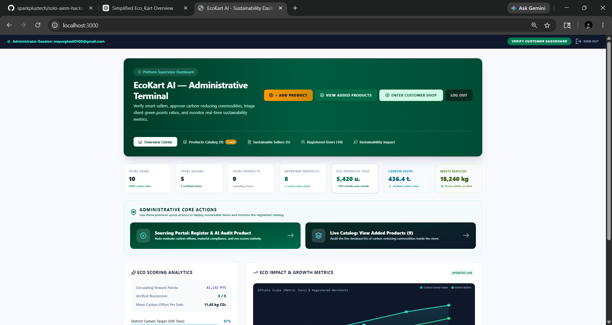

## AI-Powered Sustainable Commerce Platform

## Project Title:-EcoKart AI

## Team Name:-Brain Bytes

## Team Members
Ojas Shetye
Saloni Malik
Mayur Ghadi

## Selected Domain:- Environment and Public Safety

## Problem Statement

In today’s rapidly growing consumer market, sustainable and eco-friendly small businesses struggle to reach customers because of low visibility, high marketing costs, and lack of a dedicated digital platform.

At the same time, consumers who want environmentally responsible products often find it difficult to discover trustworthy and affordable eco-friendly alternatives. This leads to:

Slow growth of green businesses
Increased use of harmful products
Reduced awareness about sustainable living
Weak adoption of circular economy practices
Solution

EcoKart AI is an AI-powered sustainable eCommerce platform that connects eco-friendly sellers, recycled-product creators, local artisans, and environmentally conscious consumers in one digital ecosystem.

## The platform helps users:

Discover eco-friendly products
View AI-generated sustainability scores
Understand product environmental impact
Support green businesses

## EcoKart AI promotes:

Responsible shopping
Eco-friendly packaging
Circular economy practices
Digital growth for sustainable businesses

## Tech Stack Used
React / TypeScript / Tailwind CSS
Vite / Lucide React / Motion
Node.js / Express.js / ESBuild
Firebase / Firestore Rules
TSX / Autoprefixer / GitHub
Gemini / Google AI Studio / Gemini API

## AI Tools Used
Google Generative AI SDK
Google AI Studio
Gemini API
GitHub Copilot
ChatGPT
Firebase Integration for AI communication

## Features
Main Features
1. User Dashboard
   Carbon offset tracking
   Green points system
   Sustainability levels
   CO₂ reduction charts
   Purchase history
   Order tracking and cancellation
2. Eco Marketplace
   50+ eco-friendly products
   Product categories and filters
   Search and sorting
   Ratings and reviews
   Carbon offset details
   Green reward points
3. Achievement Badges
   Includes badges like:
      Eco Starter
      Green Guardian
      Planet Protector
      Sustainability Master
Users unlock badges by completing milestones.

4. AI Advisor Chatbot
   Real-time Gemini AI chat
   Sustainability tips
   Product recommendations
   Eco guidance
   Markdown-supported responses
5. Admin Console
   Product Management
   Add/Delete products
   Approve products
   View eco-scores
   Seller Management
   Track seller performance
   Verify sellers
   Ban/Activate sellers
   User Management
   Manage users
   Track green points
   Block/Unblock accounts
   Analytics
   Revenue tracking
   Carbon offset statistics
   Platform growth data
6. Authentication
   User/Admin login
   Role management
   Session handling
   Demo login support
7. Database Features
   Firebase stores:
   User data
   Products
   Orders
   Seller details
   Badges
8. Gamification
   Green points
   Reward tiers
   Leaderboards
   Achievement system

## How to Run the Project
Download or clone the project:- git clone <repository-link>
Open the project folder :- cd EcoKartAI
Install dependencies:- npm install
Add environment variables in .env.local
   GEMINI_API_KEY=your_api_key
Run the project:- npm run dev
Open in browser:- http://localhost:5173

## Demo / Screenshots
## Demo / Screenshots

### Live Dashboard with sustainability tracking

### AI Chatbot for eco recommendations

### Marketplace for eco-friendly products

### Admin management dashboard

## Future Scope
Mobile application support using React Native
AI-based personalized product recommendations
Blockchain-based carbon credit verification
Multi-language support for global users
Online payment gateway integration
Community eco-challenges and leaderboards
Advanced analytics and sustainability reports
Integration with NGOs and carbon offset programs
Barcode scanning for product sustainability checking
Enhanced security with two-factor authentication (2FA)

## Run Locally

**Prerequisites:**  Node.js
1. Install dependencies:
   `npm install`
2. Set the `GEMINI_API_KEY` in [.env.local](.env.local) to your Gemini API key
3. Run the app:
   `npm run dev`
